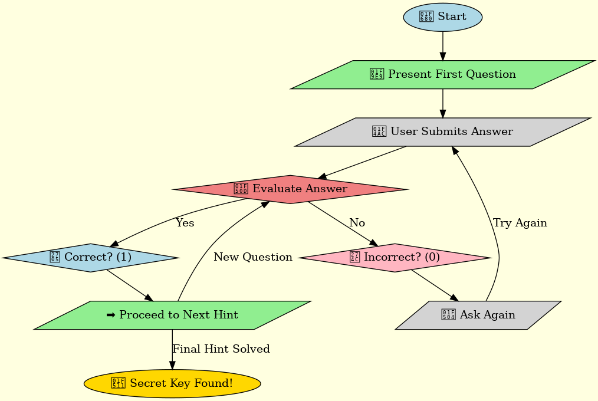

# Chatbot for Secret Key Discovery 🔐

Welcome to the **Secret Key Discovery Chatbot**! This chatbot guides users through a series of hints and puzzles, helping them find a secret key. The chatbot follows a structured tree-based approach to evaluate user answers and provide further hints accordingly.

## 🚀 Features
- 🧩 Riddle, math, and logic-based questions.
- 🔁 Tracks user progress in finding hints.
- 🔄 Asks multiple questions before revealing the next hint.
- 🏆 Successfully answering all hints leads to discovering the secret key!

## 🛠️ How It Works
1. The chatbot presents the **first question**.
2. The user submits an **answer**.
3. The chatbot **evaluates** the answer:
   - ✅ **Correct:** Proceeds to the next hint.
   - ❌ **Incorrect:** Asks again until the correct answer is provided.
4. The process continues until the user discovers the **secret key**. 🔑

## 📜 Flowchart
Below is a flowchart illustrating the chatbot's flow:

